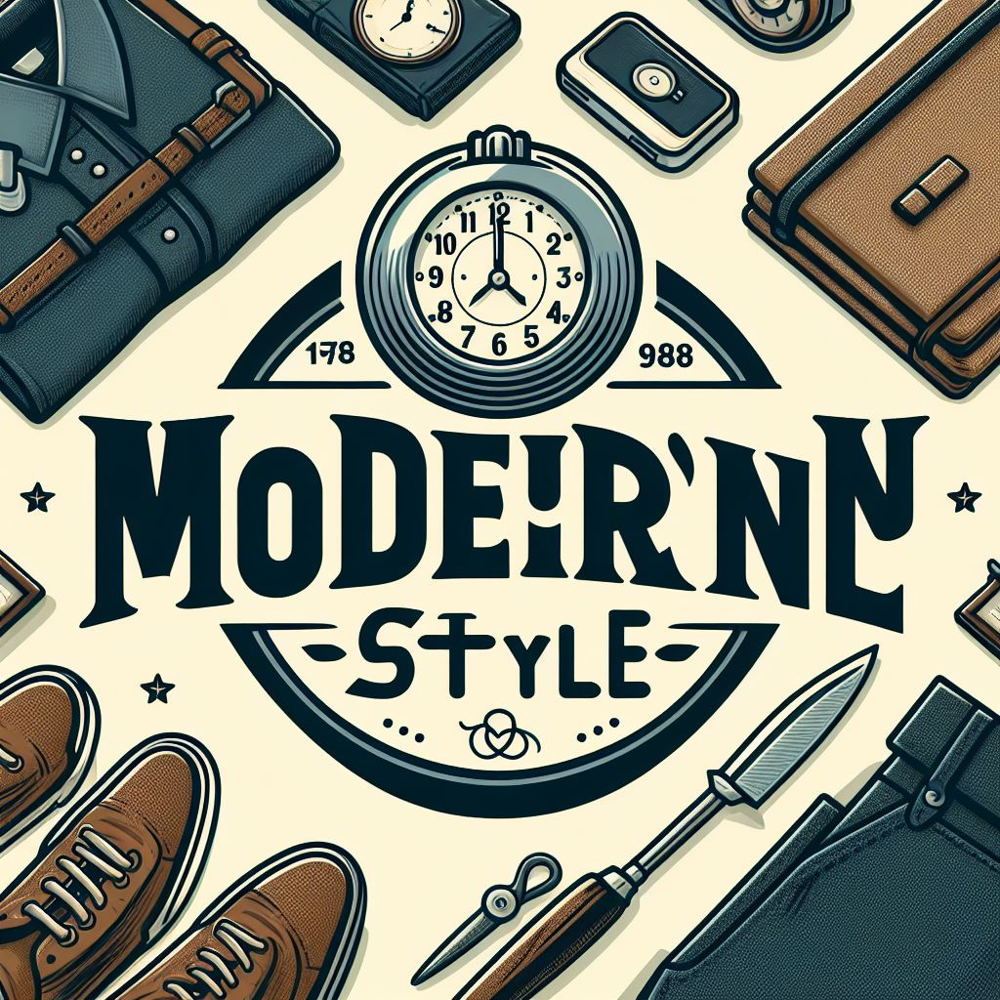

# Anteproyecto

## ModernStyle

| Autor: Jesús Jiménez Montes de Oca |
|-----------------------------------|
| I.E.S Francisco Romero Vargas (Jerez de la Frontera) |
| Desarrollo de Aplicaciones Web (DAW) |
| Curso: 2023/2024                     |

## Tabla de contenido

- [Diseño y Planificación del Proyecto. Anteproyecto](#diseño-y-planificación-del-proyecto-anteproyecto)
  - [Introducción](#introducción)
  - [Finalidad](#finalidad)
  - [Objetivos](#objetivos)
  - [Medios necesarios](#medios-necesarios)
  - [Planificación](#planificación)

## Diseño y Planificación del Proyecto. Anteproyecto

### Introducción

En este documento de anteproyecto veremos los pasos para la creación de una tienda de ropa online. En la cual tendremos varios apartados según lo que necesitemos como accesorios, ropa en general sea del género que sea, etc. Después al seleccionar un producto nos redirigirá a una página donde tendremos información del producto seleccionado. Y tendremos una página de carrito para realizar las compras.

### Finalidad

La finalidad principal de este proyecto basado en una tienda de ropa online es que todos los usuarios que accedan tengan un fácil manejo de ella sea cual sea el usuario. Algunos de los objetivos específicos que se buscan lograr incluyen:

1. **Actualización Manual:** La aplicación se conectará a la base de datos en la cuál tendrá toda la información de los productos. Esta base de datos tendré que irla actualizando.
2. **Búsqueda Selectiva:** Los usuarios podrán realizar búsquedas selectivas en el catálogo de ropa utilizando diversos filtros. Esto facilitará la búsqueda específica y mejorará la experiencia del usuario.
3. **Experiencia de Usuario Mejorada:** La finalidad última es brindar a los usuarios una experiencia de usuario atractiva y de alta calidad al interactuar con el catálogo de ropa. Esto incluye una interfaz intuitiva, tiempos de carga rápidos y una navegación sin problemas.
4. **Escalabilidad:** El proyecto se desarrollará teniendo en cuenta la escalabilidad futura. Se podrán agregar características adicionales, como recomendaciones personalizadas, integración con redes sociales y más, para enriquecer aún más la experiencia del usuario.

### Objetivos

1. **Implementación de Búsqueda Avanzada:** Desarrollar una funcionalidad de búsqueda que permita a los usuarios buscar ropa en concreto.
2. **Visualización Detallada de Ropa:** Crear una interfaz de usuario que permita a los usuarios acceder a información detallada de la ropa incluyendo el color, las tallas, el precio, etc.
3. **Optimización de la Experiencia del Usuario:** Garantizar que la interfaz de usuario sea intuitiva y fácil de navegar, brindando a los usuarios una experiencia atractiva al explorar el catálogo y ver información detallada.
4. **Secciones Predefinidas:** Implementar secciones predefinidas como "Novedades", "Populares" y "Mejor Valoradas" para facilitar la navegación.
5. **Escalabilidad:** Diseñar el proyecto de manera que sea escalable para futuras adiciones de características y contenido, lo que permitirá mantenerlo actualizado y en evolución.

### Medios necesarios

Para la realización de este proyecto se necesita lo siguiente:

- **Hardware y Software:**
  - **Computadora:** Una computadora personal o portátil adecuada para el desarrollo de software.
  - **Sistema Operativo:** Un sistema operativo compatible para el desarrollo.
  - **Entorno de Desarrollo:** Un entorno de desarrollo integrado (IDE) o editor de código.
  - **Acceso a Internet:** Una conexión a Internet confiable.
  - **Recursos Gráficos:** Imágenes y recursos gráficos relacionados con la ropa y la moda.
  - **Base de Datos:** Para almacenar datos del catálogo de la tienda online y, si es necesario, datos de usuarios.

- **Licencias:** Este proyecto no necesita licencias propietarias.

### Planificación

- **Semana 1:** Estructura de las páginas.
- **Semana 2:** Implementación del código.
- **Semana 3-4:** Diseño visual con Bootstrap.
- **Semana 5-6:** Creación de la base de datos.
- **Semana 7-8:** Conexión de las páginas web con las bases de datos.
- **Semana 9-10:** Toques finales al proyecto.

**Evaluación y Mejoras Posteriores (Post-Entrega)**

**Horas totales planificadas para el proyecto:** 64.
